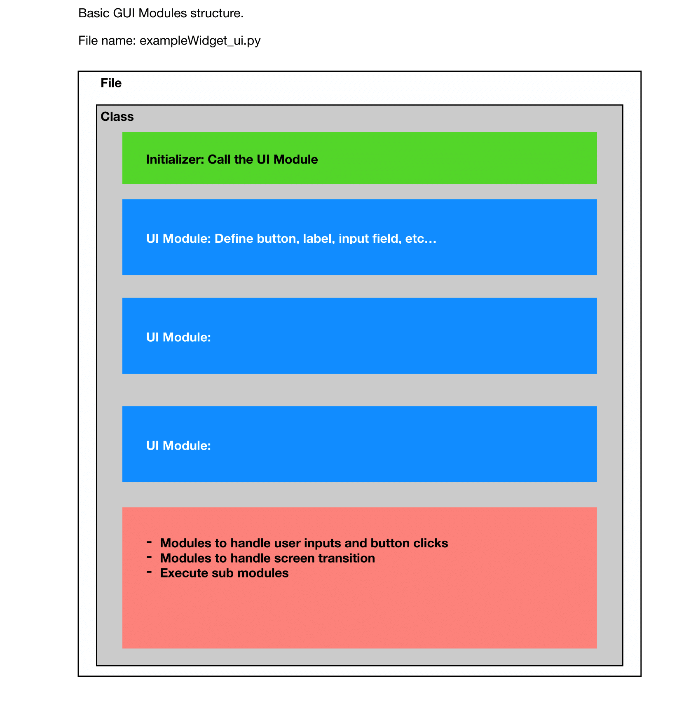

# V3

<!-- PROJECT SHIELDS -->


<!-- PROJECT LOGO -->
<br />
<p align="center">
  <a href="https://github.com/github_username/repo_name">
    
  </a>

  <h3 align="center">TDX Desktop ("V3")</h3>

  <p align="center">
    Technical documentation for TDX Desktop.
    <br />
    <a href="https://github.com/github_username/repo_name"><strong>Explore the docs »</strong></a>
    <br />
    <br />
    <a href="https://github.com/github_username/repo_name">View Demo</a>
    ·
    <a href="https://github.com/github_username/repo_name/issues">Report Bug</a>
    ·
    <a href="https://github.com/github_username/repo_name/issues">Request Feature</a>
  </p>
</p>


<!-- TABLE OF CONTENTS -->
<details open="open">
  <summary><h2 style="display: inline-block">Table of Contents</h2></summary>
  <ol>
    <li>
      <a href="#about-the-project">About The Project</a>
      <ul>
        <li><a href="#built-with">Built With</a></li>
      </ul>
    </li>
    <li>
      <a href="#getting-started">Getting Started</a>
      <ul>
        <li><a href="#prerequisites">Prerequisites</a></li>
        <li><a href="#installation">Installation</a></li>
      </ul>
    </li>
    <li><a href="#usage">Usage</a></li>
    <li><a href="#technical-documentation">Technical Document</a></li>
    <li><a href="#license">License</a></li>
    <li><a href="#contact">Contact</a></li>
    <li><a href="#acknowledgements">Acknowledgements</a></li>
  </ol>
</details>


<!-- ABOUT THE PROJECT -->
## About The Project

TDX Desktop ("V3") is a desktop application which helps network designers to create path profiles,
coverage maps, KML files. The V3 UI helps users to complete each task seamlessly and return the
optimized results.


### Built With

* [Python 3](https://www.python.org)
* [PyQt 5](https://pypi.org/project/PyQt5/)
* [Pandas](https://pandas.pydata.org)
* [PyInstaller](http://www.pyinstaller.org)


<!-- GETTING STARTED -->
## Getting Started

To get a local copy up and running follow these simple steps.

### Prerequisites

This is an example of how to list things you need to use the software and how to install them.
* Check if your local machine have <b>Git</b> installed.
  ```sh
  git --version
  ```
* Check if your local machine have <b>Python 3</b> installed.
  ```sh
  python --version
  ```
  or
  ```sh
  python3 --version
  ```
* Check if <b>pip</b> is installed and linked to Python 3.
  ```sh
  python -m pip --version

  ```
  or
  ```sh
  python3 -m pip --version
  ```

### Installation

1. Clone the repo
    ```sh
    git clone https://github.com/techdataexplorer/V3.git
    ```
2. Upgrade pip
    ```sh
    python -m pip install --upgrade pip
    ```
    or
    ```sh
    python3 -m pip install --upgrade pip
    ```
3. Install python libraries
    ```sh
    python -m pip install -r requirements.txt
    ```
    or
    ```sh
    python3 -m pip install -r requirements.txt
    ```
    or install each dependencies one by one.
4. Check current branch
    ```sh
    git branch
    ```
5. Change branch from <b>main</b> to <b>test</b>.
    ```sh
    git checkout test
    ```
6. Brach out from test branch and name your branch with the combination "YOURNAME" + "_" + "test".
    ```sh
    git checkout -b che_test
    ```
7. Check branch status
    ```sh
    git status
    ```
8. If branch is up to date, you are ready to run the application.
    ```sh
    cd src
    python3 main.py
    ```


<!-- USAGE EXAMPLES -->
## Usage

Use this space to show useful examples of how a project can be used. Additional screenshots, code examples and demos work well in this space. You may also link to more resources.

_For more examples, please refer to the [Documentation](https://www.spatialdatalyst.com)_


<!-- TECHNICAL DOCUMENTATION -->
## Technical Documentation

How the Gui classes are defined.




<!-- LICENSE -->
## License

Distributed under the MIT License. See `LICENSE` for more information.


<!-- CONTACT -->
## Contact

Che Blankenship - [che.blankenship@utdallas.edu](che.blankenship@utdallas.edu) - email

Project Link: [https://github.com/techdataexplorer/V3](https://github.com/techdataexplorer/V3)


<!-- ACKNOWLEDGEMENTS -->
## Acknowledgements

* []()
* []()
* []()
